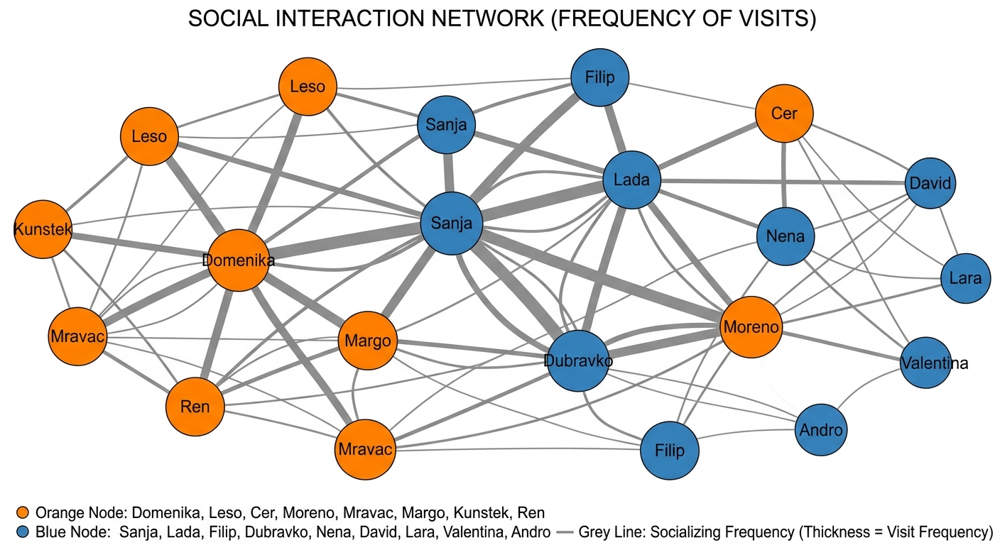
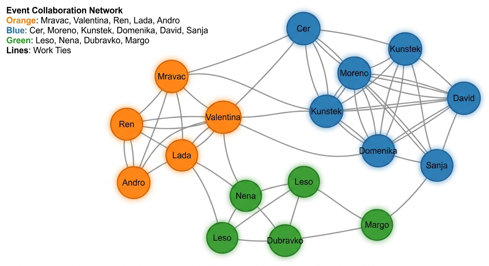
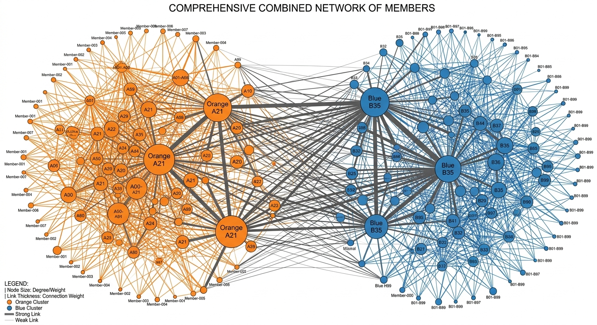

# Network Metrics Visualizer

Ova aplikacija omogućuje vizualizaciju mrežnih metrika iz Google tablica s naglaskom na analizu društvenih odnosa i strukture mreže.

## Rezultati Mrežne Analize: Udruga Kulturni Front

Kao dio ove vizualizacijske platforme, provedena je sustavna sociometrijska i mrežna analiza udruge **Kulturni front**, a rezultati su mapirani na kognitivne i formalne mrežne strukture kroz tri ključna modela:

### 1. Društvena mreža (Neformalno druženje i posjeti)
Ova dimenzija prikazuje neformalno povezivanje i koheziju članova izvan formalnih projekata udruge.

*Slika 1: Cjeloviti graf neformalnih druženja i posjeta. Narančasti čvorovi tvore iznimno čvrstu kohezijsku jezgru (Mravac, Moreno, Cer, Margo, Kunštek), dok su plavi čvorovi periferniji.*

*Slika 2: Neformalni susreti i zajedničke klupske aktivnosti koje čine temeljno emocionalno vezivo udruge.*

---

### 2. Organizacijska mreža (Suradnja na eventima)
Grafika formalne suradnje prikazuje funkcionalnu podjelu uloga i stabilne radne grupe rekonstruirane s obzirom na projektnu suradnju.

*Slika 3: Struktura suradnje na projektima (zeleni klaster za kreativne radionice, narančasti za logističku operativnu kralježnicu, plavi za teorijski i tehnički krug).*

*Slika 4: Javna predavanja, debate i tribine u sklopu projekta Coffee House Debates oslanjaju se na preciznu projektnu suradnju.*

---

### 3. Cjelovita mreža povezanosti (Sinteza)
Ujedinjeni težinski model (Unified Relationship Network) prikazuje cjelovitu sinergiju neformalnih interakcija i službenog rada, jasno identificirajući dualne liderske stupove udruge (Mravac i Cer).

*Slika 5: Cjeloviti težinski graf ujedinjenih mrežnih veza. Veličina čvora predstavlja utjecaj člana (Weighted Degree), dok debljina veza odražava ukupnu učestalost i dubinu kontakata.*

---

## Opis aplikacije

**Network Metrics Visualizer** je alat dizajniran za istraživače i analitičare podataka koji žele dublji uvid u strukturu svojih mreža. Aplikacija se povezuje izravno s Google Sheets dokumentom i automatski generira grafikone za ključne mrežne indikatore:

- **Degree (Stupanj čvora):** Broj izravnih veza koje čvor ima.
- **Weighted Degree (Težinski stupanj):** Zbroj težina svih veza čvora.
- **Closeness (Bliskost):** Mjera koliko je čvor blizu svim ostalim čvorovima u mreži.
- **Betweenness (Između):** Mjera koliko često čvor služi kao most na najkraćem putu između drugih čvoriva.
- **Eigenvector (Svojstvena centralnost):** Mjera utjecaja čvora u mreži na temelju važnosti njegovih susjeda.

## Ključne značajke

- **Klasterizacija:** Podaci se automatski grupiraju prema kategorijama (klasterima) definiranim u tablici.
- **Interaktivni grafikoni:** Korisnici mogu birati između različitih kategorija kako bi izolirali i analizirali specifične dijelove mreže.
- **Analiza odnosa:** Poseban grafikon raspršenja (Scatter Chart) omogućuje usporedbu korelacija između različitih metrika, poput povezanosti "Betweenness" i "Eigenvector" centralnosti.
- **Google integracija:** Sigurna prijava putem Google računa i direktno čitanje podataka iz zaštićenih tablica.

## Tehnološki stog

- **React:** Za izgradnju dinamičnog korisničkog sučelja.
- **Tailwind CSS:** Za moderan i responzivan dizajn.
- **Recharts:** Za renderiranje preciznih i vizualno privlačnih grafikona.
- **Firebase Auth:** Za sigurnu autentifikaciju korisnika putem Googlea.
- **Google Sheets API:** Za sinkronizaciju podataka u stvarnom vremenu.

## Kako koristiti

1. Prijavite se koristeći svoj Google račun.
2. Aplikacija će automatski povući podatke iz predefinirane tablice (ID: `1TqRayTN2RE8...`).
3. Odaberite željeni **klaster** iz gornjeg izbornika kako biste vidjeli metrike specifične za tu grupu.
4. Analizirajte bar grafikone za pojedinačne metrike ili scatter grafikon na dnu stranice za uvid u globalne trendove mreže.
