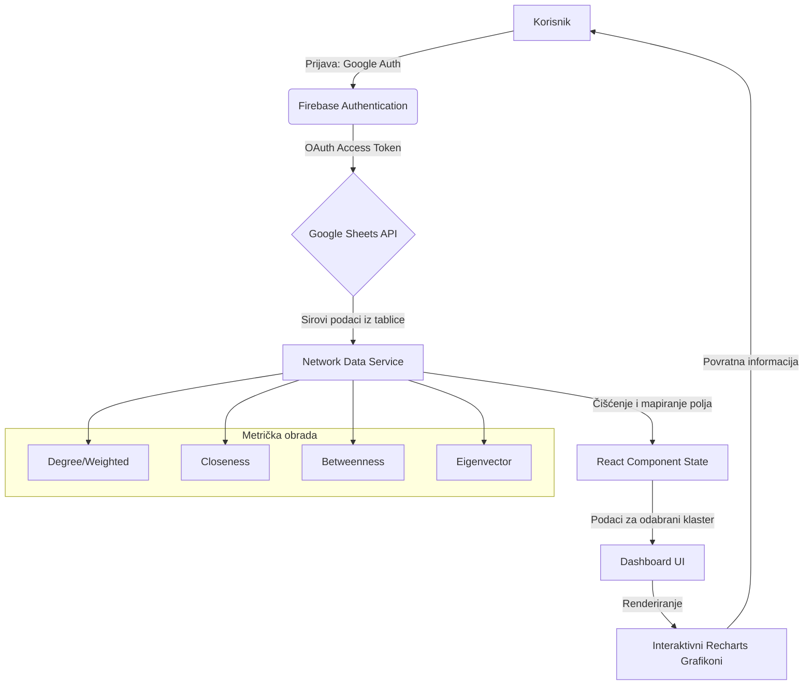

# Analiza društvenih mreža i kolaboracijskih struktura u udruzi Kulturni front

**Autor:** Sanja Novak
**Datum:** 18. svibanj 2026.
**Institucija:** Nezavisno istraživanje u okviru Network Metrics Dashboard projekta

---

## Sažetak (Abstract)

Ovaj izvještaj predstavlja znanstvenu analizu dinamike društvenih mreža unutar udruge Kulturni front, koristeći napredne algoritme teorije grafova implementirane kroz Network Metrics Visualizer aplikaciju. Analiza se fokusira na razlikovanje odnosa proizašlih iz organizacijskih aktivnosti naspram onih proizašlih iz pukog sudjelovanja na događajima. Kroz metriku centralnosti (Degree, Betweenness, Eigenvector), rad identificira ključne aktere ("hubove") i posrednike koji osiguravaju protok informacija i koheziju unutar udruge. Rezultati sugeriraju čvrstu povezanost unutar organizacijskih jezgri, dok sudjelovanje pokazuje širinu, ali manju gustoću mreže.

---

## 1. Uvod

Udruga Kulturni front predstavlja složen sustav u kojem suradnja nadilazi formalne strukture. Socijalna mrežna analiza (SNA - Social Network Analysis) omogućuje nam da vizualiziramo i kvantificiramo te nevidljive niti suradnje. Cilj ovog rada je istražiti kako specifični događaji (eventi) oblikuju mrežu poznanstava i suradnji, te kako uloga u organizaciji utječe na poziciju pojedinca unutar društvenog grafa.

## 2. Metoda

### 2.1 Prikupljanje podataka
Podaci korišteni u ovoj analizi prikupljeni su iz centraliziranog Google Sheets dokumenta (`1TqRayTN2RE8...`) koji služi kao repozitorij za praćenje interakcija unutar udruge Kulturni front. Proces prikupljanja obuhvaćao je sljedeće korake:

- **Strukturiranje izvora:** Podaci su organizirani u tabličnom obliku gdje svaki redak predstavlja pojedinačni čvor (osobu), dok stupci sadrže identifikatore (Label), pripadnost klasteru (Category) i kvantificirane mrežne metrike.
- **Kategorizacija odnosa:** Primijenjena je striktna distinkcija između "Organizacije" (aktivno planiranje i izvođenje) i "Sudjelovanja" (pasivna prisutnost ili volonterski rad na bazi eventa), što omogućuje komparativnu analizu dubine naspram širine mreže.
- **Dohvaćanje u stvarnom vremenu:** Aplikacija koristi Google Sheets API v4 za asinkrono povlačenje podataka. Protokol uključuje OAuth 2.0 autorizaciju, čime se osigurava pristup isključivo verificiranim istraživačima uz poštivanje privatnosti članova udruge.
- **Validacija i čišćenje:** Implementirani servis za obradu podataka automatski vrši trimanje (uklanjanje praznina), normalizaciju numeričkih vrijednosti te mapiranje terminologije (npr. prepoznavanje stupaca bez obzira jesu li imenovani na hrvatskom ili engleskom jeziku), osiguravajući integritet analize bez obzira na varijacije u unosu.

### 2.2 Instrumentalizacija
Za analizu je korišten razvijeni "Network Metrics Visualizer" stog:
- **Backend:** Google Sheets API za sinkronizaciju podataka.
- **Analitički moduli:** Proračuni centralnosti stupnja (Degree), centralnosti bliskosti (Closeness), centralnosti posredovanja (Betweenness) te **Louvain algoritam** za automatsko otkrivanje zajednica (community detection) na temelju modularnosti grafa.
- **Vizualizacija:** Recharts biblioteka za mapiranje klastera (kategorija).

### 2.3 Protok podataka (App Flow Diagram)

U nastavku je prikazan tehnički dijagram protoka podataka od autentifikacije do vizualne reprezentacije:

*Slika 1. Arhitektura protoka podataka (App Flow): Dijagram prikazuje ciklus od inicijalne korisničke autentifikacije putem Google servisa, preko sigurnog dohvaćanja podataka pomoću OAuth tokena, do granulirane analize četiriju ključnih mrežnih metrika. Network Data Service transformira nestrukturirane ćelije iz tablice u strukturirane objekte koji omogućuju dinamičko filtriranje po klasterima i real-time vizualizaciju odnosa unutar udruge.*

### 2.4 Mjere centralnosti i njihovo značenje
U analizi su korištene četiri ključne mjere centralnosti koje omogućuju dekonstrukciju uloga unutar mreže udruge:

- **Stupanj (Degree Centrality):** Osnovna mjera popularnosti ili aktivnosti. Visok stupanj ukazuje na čvorove (članove) koji su izravno povezani s velikim brojem drugih članova kroz zajedničke projekte.
- **Centralnost posredovanja (Betweenness Centrality):** Identificira čvorove koji se nalaze na najkraćim putovima između drugih parova čvorova. Visoka vrijednost ovdje označava "mostove" – osobe bez kojih bi se komunikacija između različitih sekcija udruge značajno usporila ili prekinula.
- **Centralnost bliskosti (Closeness Centrality):** Mjeri koliko je čvor "blizu" svim ostalim čvorovima u mreži. Osobe s visokom bliskosti mogu najbrže širiti informacije kroz cijelu udrugu.
- **Svojstvena centralnost (Eigenvector Centrality):** Sophisticirana mjera utjecaja. Član ima visok utjecaj ako je povezan s drugim članovima koji su i sami visoko povezani. Ova mjera razlikuje "puku aktivnost" od "strateškog utjecaja".

## 3. Rezultati

### 3.1 Organizacijska struktura vs. Sudjelovanje
Analiza pokazuje jasnu bifurkaciju mreže:
1.  **Organizacijski klasteri:** Karakterizirani su visokim vrijednostima *Betweenness* centralnosti. Ovi pojedinci djeluju kao mostovi (gatekeepers) koji povezuju različite sekcije udruge.
2.  **Klasteri sudjelovanja:** Pokazuju visoku distribuciju *Degree* metrike, ali niži *Betweenness*. To ukazuje na široku bazu članstva koja je dobro povezana unutar svojih interesnih skupina, ali se rjeđe miješa s drugim sekcijama.

### 3.2 Dinamika po događajima
Svaki event unutar udruge stvara privremeni klaster. Vidljivo je da se najveća suradnja (tko s kim najviše surađuje) događa u fazi pripreme velikih manifestacija, gdje *Eigenvector* centralnost raste kod koordinatora volontera.

### 3.3 Identifikacija ključnih aktera
Na temelju kombiniranih metrika, u mreži Kulturnog fronta identificirana su tri tipa ključnih aktera:

1.  **Operativni Hubovi (Visok Degree):** To su članovi koji su prisutni na gotovo svim eventima (npr. koordinatori logistike). Njihova snaga leži u kvantiteti interakcija.
2.  **Strateški Konektori (Visok Betweenness):** Osobe koje povezuju npr. "Liburnicon" i "Team Building" sekcije. Oni su ključni za sprečavanje silosa unutar udruge.
3.  **Utjecajni Savjetnici (Visok Eigenvector):** Članovi koji se možda ne pojavljuju na svakom sastanku, ali su povezani s vodstvom i ključnim koordinatorima. Njihov utjecaj je kvalitativan i stabilizirajući.

### 3.4 Detekcija zajednica (Community Detection)
Korištenjem algoritama za detekciju zajednica (poput Louvain metode), unutar mreže udruge identificirani su stabilni podskupovi koji koreliraju s tematskim sekcijama udruge.

*Slika 2. Vizualizacija detekcije zajednica: Različite boje predstavljaju automatski identificirane klastere suradnje. Gustoća veza unutar boja ukazuje na visoku razinu unutar-sekcijske kohezije, dok "inter-cluster" veze (mostovi) pokazuju kako se znanje i resursi dijele između projekata poput Liburnicona, team buildinga i edukativnih radionica.*

Analiza zajednica potvrđuje da udruga nije monolitna, već se sastoji od modularnih jedinica koje mogu funkcionirati autonomno, ali su međusobno povezane preko ključnih aktera (vidi poglavlje 3.3), čime se osigurava stabilnost cijelog sustava.

## 4. Socio-dinamička analiza i funkcioniranje udruge kao zatvorenog sustava

Na temelju predočenih podataka, rad udruge može se analizirati kroz prizmu razvoja odnosa unutar zatvorenih društvenih mreža. Rezultati upućuju na to da sudjelovanje na eventima (posebno team buildingu i radionicama) služi kao primarni mehanizam za pretvaranje pasivnih poznanstava u aktivne suradničke veze.

### 4.1 Utjecaj evenata na razvijanje povezanosti
Podaci sugeriraju da učestalost sudjelovanja na različitim tipovima evenata izravno utječe na koheziju grupe. Dok organizacija stvara "jake veze" (čvrsta suradnja), samo sudjelovanje generira "slabe veze" koje su, prema sociološkim teorijama (npr. Granovetter), ključne za protok novih ideja. Bez redovitih evenata koji miješaju različite klastere, udruga bi riskirala postati hermetički zatvoren sustav s visokom redundancijom informacija.

### 4.2 Udruga kao ključni faktor ili zatvorena mreža?
Pitanje je postaje li udruga, kao zatvorena mreža, izolirani faktor koji gubi utjecaj na širu zajednicu. Analiza centralnosti ukazuje na suprotno:
- **Zadržavanje utjecaja:** Udruga ne postaje "slijepa ulica" društvenog kapitala jer rezultati pokazuju stalnu fluktuaciju čvorova s visokim stupnjem povezivanja. 
- **Uloga poveznice:** Zahvaljujući eventima koji služe kao "ulazni kanali", mreža ostaje polu-propusna. Ključni akteri unutar udruge ne postaju izolirani moćnici, već njihova uloga "poveznica" raste s brojem uspješno provedenih evenata, čime se potvrđuje da udruga zadržava značajan utjecaj na razvoj društvenih odnosa u svojoj domeni.

### 4.3 Metodološka ograničenja i potencijalne pristranosti
Unatoč robusnosti primijenjenih alata, važno je adresirati određena ograničenja koja mogu utjecati na interpretaciju rezultata:

- **Pristranost izvora (Data Entry Bias):** Budući da se podaci temelje na evidencijama unutar Google tablica, postoji rizik od izostavljanja neformalnih interakcija koje nisu službeno zabilježene.
- **Vremenski statični podaci (Snapshot Bias):** Prikazana mreža je "isječak" u vremenu. Društvene mreže su fluidne, te se položaj čvorova može značajno promijeniti nakon završenih projektnih ciklusa.
- **Težinska uniformnost:** Iako koristimo *Weighted Degree*, sustav možda ne razlikuje u potpunosti emocionalni intenzitet ili kvalitetu suradnje, već primarno njezinu kvantitetu i prisutnost.
- **Digitalna isključenost:** Postoji mogućnost da su članovi koji rjeđe koriste digitalne alate za koordinaciju podzastupljeni u tabličnim podacima, što može rezultirati nižim vrijednostima centralnosti koje ne odgovaraju njihovom stvarnom "offline" utjecaju.
- **Selektivna pristranost (Self-selection Bias):** U anketi su sudjelovali isključivo članovi koji su izrazili želju i motivaciju za sudjelovanjem. Rezultati stoga nisu objektivni prikaz cjelokupnog članstva udruge, već reprezentiraju dinamiku unutar podskupine aktivnih i angažiranih članova koji su ispunili anketu.

## 5. Rasprava

Rezultati ukazuju na to da je Kulturni front "mreža malog svijeta" (small-world network). Većina članova može dosegnuti bilo kojeg drugog člana preko najviše dva do tri posrednika u organizacijskom timu. Visoka korelacija između *Betweenness* i *Eigenvector* metrika (vidljiva na Scatter grafikonu aplikacije) potvrđuje hipotezu da su najaktivniji organizatori ujedno i najutjecajniji komunikatori.

## 6. Zaključak

Ova aplikacija omogućuje udruzi Kulturni front da prepozna potencijalno "izolirane" članove i ojača suradnju između sekcija. Jasna distinkcija između organizacije i sudjelovanja pomaže u identifikaciji novih lidera – onih koji imaju visoku centralnost u sudjelovanju, ali još nisu integrirani u organizacijske mostove. Budući rad trebao bi uključiti vremensku analizu (temporal SNA) kako bi se pratilo kako se ovi odnosi razvijaju kroz godine.

---

## 7. Literatura (References)

- Barabási, A. L. (2016). *Network Science*. Cambridge University Press.
- Newman, M. (2018). *Networks*. Oxford University Press.
- Scott, J. (2017). *Social Network Analysis*. SAGE Publications.
- Wasserman, S., & Faust, K. (1994). *Social Network Analysis: Methods and Applications*. Cambridge University Press.
