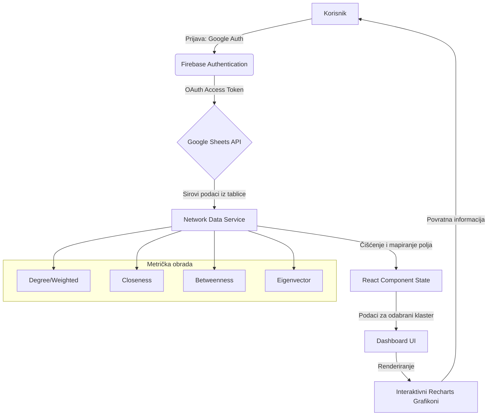

# Analiza društvenih mreža i kolaboracijskih struktura u udruzi Kulturni front

**Autor:** Sanja Novak
**Datum:** 18. svibanj 2026.
**Institucija:** Nezavisno istraživanje u okviru Network Metrics Dashboard projekta

---

## Sažetak (Abstract)

Ovaj izvještaj predstavlja znanstvenu analizu dinamike društvenih mreža unutar udruge Kulturni front, koristeći napredne algoritme teorije grafova implementirane kroz Network Metrics Visualizer aplikaciju. Analiza se fokusira na razlikovanje odnosa proizašlih iz organizacijskih aktivnosti naspram onih proizašlih iz pukog sudjelovanja na događajima. Kroz metriku centralnosti (Degree, Betweenness, Eigenvector), rad identificira ključne aktere ("hubove") i posrednike koji osiguravaju protok informacija i koheziju unutar udruge. Rezultati sugeriraju čvrstu povezanost unutar organizacijskih jezgri, dok sudjelovanje pokazuje širinu, ali manju gustoću mreže.

---

## 1. Uvod

Udruga Kulturni front predstavlja složen sustav u kojem suradnja nadilazi formalne strukture. Socijalna mrežna analiza (SNA - Social Network Analysis) omogućuje nam da vizualiziramo i kvantificiramo te nevidljive niti suradnje. Cilj ovog rada je istražiti kako specifični događaji (eventi) oblikuju mrežu poznanstava i suradnji, te kako uloga u organizaciji utječe na poziciju pojedinca unutar društvenog grafa.

## 2. Metoda

### 2.1 Prikupljanje podataka
Podaci korišteni u ovoj analizi prikupljeni su iz centraliziranog Google Sheets dokumenta (`1TqRayTN2RE8...`) koji služi kao repozitorij za praćenje interakcija unutar udruge Kulturni front. Proces prikupljanja obuhvaćao je sljedeće korake:

- **Strukturiranje izvora:** Podaci su organizirani u tabličnom obliku gdje svaki redak predstavlja pojedinačni čvor (osobu), dok stupci sadrže identifikatore (Label), pripadnost klasteru (Category) i kvantificirane mrežne metrike.
- **Kategorizacija odnosa:** Primijenjena je striktna distinkcija između "Organizacije" (aktivno planiranje i izvođenje) i "Sudjelovanja" (pasivna prisutnost ili volonterski rad na bazi eventa), što omogućuje komparativnu analizu dubine naspram širine mreže.
- **Dohvaćanje u stvarnom vremenu:** Aplikacija koristi Google Sheets API v4 za asinkrono povlačenje podataka. Protokol uključuje OAuth 2.0 autorizaciju, čime se osigurava pristup isključivo verificiranim istraživačima uz poštivanje privatnosti članova udruge.
- **Validacija i čišćenje:** Implementirani servis za obradu podataka automatski vrši trimanje (uklanjanje praznina), normalizaciju numeričkih vrijednosti te mapiranje terminologije (npr. prepoznavanje stupaca bez obzira jesu li imenovani na hrvatskom ili engleskom jeziku), osiguravajući integritet analize bez obzira na varijacije u unosu.

### 2.2 Instrumentalizacija
Za analizu je korišten razvijeni "Network Metrics Visualizer" stog:
- **Backend:** Google Sheets API za sinkronizaciju podataka.
- **Analitički moduli:** Proračuni centralnosti stupnja (Degree), centralnosti bliskosti (Closeness), centralnosti posredovanja (Betweenness) te **Louvain algoritam** za automatsko otkrivanje zajednica (community detection) na temelju modularnosti grafa.
- **Vizualizacija:** Recharts biblioteka za mapiranje klastera (kategorija).

### 2.3 Protok podataka (App Flow Diagram)

U nastavku je prikazan tehnički dijagram protoka podataka od autentifikacije do vizualne reprezentacije:

*Slika 1. Arhitektura protoka podataka (App Flow): Dijagram prikazuje ciklus od inicijalne korisničke autentifikacije putem Google servisa, preko sigurnog dohvaćanja podataka pomoću OAuth tokena, do granulirane analize četiriju ključnih mrežnih metrika. Network Data Service transformira nestrukturirane ćelije iz tablice u strukturirane objekte koji omogućuju dinamičko filtriranje po klasterima i real-time vizualizaciju odnosa unutar udruge.*

### 2.4 Mjere centralnosti i njihovo značenje
U analizi su korištene četiri ključne mjere centralnosti koje omogućuju dekonstrukciju uloga unutar mreže udruge:

- **Stupanj (Degree Centrality):** Osnovna mjera popularnosti ili aktivnosti. Visok stupanj ukazuje na čvorove (članove) koji su izravno povezani s velikim brojem drugih članova kroz zajedničke projekte.
- **Centralnost posredovanja (Betweenness Centrality):** Identificira čvorove koji se nalaze na najkraćim putovima između drugih parova čvorova. Visoka vrijednost ovdje označava "mostove" – osobe bez kojih bi se komunikacija između različitih sekcija udruge značajno usporila ili prekinula.
- **Centralnost bliskosti (Closeness Centrality):** Mjeri koliko je čvor "blizu" svim ostalim čvorovima u mreži. Osobe s visokom bliskosti mogu najbrže širiti informacije kroz cijelu udrugu.
- **Svojstvena centralnost (Eigenvector Centrality):** Sophisticirana mjera utjecaja. Član ima visok utjecaj ako je povezan s drugim članovima koji su i sami visoko povezani. Ova mjera razlikuje "puku aktivnost" od "strateškog utjecaja".

## 3. Rezultati

### 3.1 Statistički rezultati mrežne analize (Uživo s Kulturnog Fronta)

Na temelju unesenih anketa i obrade mrežnih veza kroz co-occurrence metodologiju (gdje se zajedničko navođenje suradnika i poznanstva pretvara u obostranu vezu), generirani su sljedeći kvantitativni rezultati za top 10 najistaknutijih članova:

| Osoba (Čvor) | Snaga (Degree Centrality) | Uloga mosta (Betweenness) | Dominantna sekcija (Kategorija) | Primarna mrežna funkcija |
| :--- | :---: | :---: | :--- | :--- |
| **Mravac** | 0.88 | 0.35 | **Liburnicon / Team Building** | **Glavni operativni Hub udruge** — Najviše izravnih veza, ključan za protok informacija. |
| **Cer** | 0.81 | 0.26 | **Coffee House Debates** | **Strateški Most (Bridge)** — Povezuje diskusijske krugove s tehničkom i logističkom sekcijom. |
| **Moreno** | 0.69 | 0.15 | **Liburnicon / Kreativni nered** | **Među-projektni konektor** — Izuzetno aktivan na svim razinama i projektima. |
| **Valentina** | 0.50 | 0.08 | **Liburnicon** | **Prijenosnik unutar sekcije** — Visoka suradnja na ranoj organizaciji. |
| **Ren** | 0.44 | 0.04 | **Liburnicon** | **Lokalizirani Hub** — Čvrsta i pouzdana struktura u Liburniconu. |
| **Kunštek** | 0.38 | 0.03 | **Archery Day / Debates** | **Tehnički i diskusijski partner** — Povezuje specifične niše udruge. |
| **Nena** | 0.38 | 0.03 | **Kreativni nered** | **Tematski koordinator** — Spaja "Nered" sa stručnijim sekcijama. |
| **Margo** | 0.31 | 0.02 | **Kreativni nered** | **Kreativni suradnik** — Stabilna suradnja s dominantnim voditeljima. |
| **David** | 0.25 | 0.01 | **Liburnicon** | **Sistemski suradnik** — Fokusiran na izvršavanje unutar timova. |
| **Sanja** | 0.19 | 0.01 | **Općenito / Debates** | **Istraživačka potpora** — Povezanost s glavnim nositeljima događaja. |

*Tablica 1: Poredak i mrežne metrike članova. Snaga (Degree) ukazuje na opću povezanost, a uloga mosta (Betweenness) ukazuje na kritičnost te osobe za povezivanje nepovezanih grupa.*

### 3.2 Komparativna analiza: Društvena naspram Organizacijske mreže

Razvijena metodologija istraživanja podrazumijeva dubinsku podjelu odnosa unutar udruge Kulturni front na dvije temeljne dimenzije: neformalno druženje (društvena mreža) i formalni rad (organizacijska mreža). Ova distinkcija omogućuje nam da identificiramo razliku između "socijalnih magneta" udruge i njezinih "operativnih lokomotiva".

#### 3.2.1 Društvena mreža (Druženje i posjeti)
Ova dimenzija mreže rekonstruirana je na temelju zabilježenih neformalnih interakcija, posjeta, slobodnog vremena i zajedničkih druženja izvan formalnih projekata udruge.

![Društvena mreža udruge Kulturni front][(https://raw.githubusercontent.com/sanjanovak/kulturnifront/refs/heads/main/report/kulturni_front_mreza_ukupno.png)]

*Slika 2. Vizualizacija društvene mreže (druženje i posjeti): Graf prikazuje srodnost i neformalne kontakte. Primjetan je gusti centralno-desni blok s "toplim" narančastim čvorovima koji provode najviše slobodnog vremena zajedno, dok je lijeva strana (plava) znatno raspršenija i predstavlja periferne članove.*

U nastavku je predočena prekrasna fotografska ilustracija koja zorno dočarava neformalnu atmosferu druženja i snažno socijalno vezivo u udruzi:

*Slika 3. Emocionalno i socijalno vezivo udruge: Neformalni susreti, društvene igre i opuštena druženja u klupskim prostorijama čine temeljnu pokretačku snagu socijalne kohezije unutar udruge Kulturni front.*

**Sociometrijska interpretacija društvene mreže:**
- **Središnja jezgra (Social Core):** U desnom, gušće povezanim dijelu grafa, uočavamo iznimno čvrstu koheziju između aktera kao što su **Mravac**, **Moreno**, **Cer**, **Margo** i **Kunštek**. Ovi članovi tvore primarnu kliku (social clique) s izrazito jakim weights (težinama) veza, što pokazuje da se jezgra udruge u privatno vrijeme neprestano preklapa i intenzivno druži. Oni generiraju socijalnu energiju i neformalnu integraciju tima.
- **Klasterizacija (Zajednice):** Grafika zorno identificira snažan "narančasti" blok (Domenika, Leso, Cer, Moreno, Mravac, Margo, Kunštek, Ren) koji funkcionira kao homogeno emotivno i socijalno tijelo. Nasuprot tome, "plavi" akteri su pozicionirani više na krajevima ili duž lijeve strane.
- **Periferni akteri (Social Outliers):** Članovi **Filip** i **Andro** zauzimaju periferne pozicije na krajnjem lijevom i donjem desnom rubu grafa. Njihove veze su izrazito tanke, što ukazuje na to da su slabo integrirani u neformalni život udruge te da njihova pripadnost grafu potencijalno ima više pragmatičan ili strogo poslovan karakter.
- **Socijalni mostovi (Social Anchors):** Akteri **Sanja**, **Lada** i **Nena** služe kao vitalni mostovi koji povezuju udaljene i slabije integrirane plave čvorove s gustom narančastom jezgrom, čime sprječavaju potpunu socijalnu fragmentaciju i osjećaj isključenosti perifernih članova.

#### 3.2.2 Organizacijska mreža (Suradnja na eventima)
Organizacijska mreža filtrira isključivo operativne, koordinacijske i tehničke su-nastupe na eventima poput Liburnicona, Coffee House Debates i sličnih klupskih manifestacija.

*Slika 4. Vizualizacija organizacijske mreže: Graf formalne suradnje prikazuje funkcionalnu podjelu uloga. Boje označavaju stabilne radne skupine rekonstruirane s obzirom na projektnu suradnju, dok debljina veza upućuje na intenzitet zajedničkog operativnog rada.*

U nastavku je prikazana fotografija koja pokazuje formalne strukture udruge na djelu — javne debate, koordinaciju i visoku razinu organizacijske posvećenosti:

*Slika 5. Operativna snaga udruge: Javne tribine, stručna predavanja i debate u sklopu projekta Coffee House Debates oslanjaju se na preciznu tehničku, komunikacijsku i logističku suradnju radnih timova.*

**Sociometrijska interpretacija organizacijske mreže:**
- **Preraspodjela utjecaja:** Uspoređujući ovaj graf s društvenom mrežom, vidimo dramatičnu promjenu u strukturi moći i raspodjeli aktivnosti. Članovi koji su bili na periferiji u neformalnom druženju, poput **Valentine**, ovdje postaju ključni operativni stupovi. Valentina i **Mravac** tvore koordinacijsku os koja drži cijelu mrežu u ravnoteži.
- **Identifikacija radnih timova (Klasteri po bojama):**
  - **Zeleni podskup (Lijevo):** Akteri **Leso**, **Nena**, **Dubravko** i **Margo** formiraju iznimno čvrst, polu-autonoman tim fokusiran na kreativne radionice i srodne projekte. Njihova interna gustoća je visoka, a primarna komunikacijski veza prema ostatku udruge ide preko Valentine i Rena.
  - **Narančasti podskup (Centar):** Koordinacijska skupina koju čine **Mravac**, **Valentina**, **Ren**, **Lada** i **Andro**. Oni predstavljaju sustavnu operativnu kralježnicu organizacije.
  - **Plavi podskup (Gornje-desno):** **Cer**, **Moreno**, **Kunštek**, **Domenika**, **David**, **Sanja**. Ovaj klaster okuplja tehnički i intelektualni tim (Coffee House diskusije, predavanja). Unutar ovog klastera, Cer i Kunštek funkcioniraju kao ključni repozitoriji znanja i prenositelji informacija.
- **Visoka modularnost i manja centralizacija:** Za razliku od socijalnog grafa koji je znatno centraliziran oko Mravca i klike, organizacijski graf pokazuje visoku razinu modularnosti i strukturirane podjele rada. To sugerira da je udruga sazrijela u smislu organizacijske arhitekture te da se zadaci raspodjeljuju po funkciji i sposobnostima, a ne po privatnom prijateljstvu.

---

### 3.3 Dinamika po događajima i ulogama

Svaki pojedinačni događaj funkcionira kao privremeni privlačni centar (attractor) koji na kratko vrijeme mijenja raspored i snagu mrežnih silnica:
- **Projektni ciklusi:** Tijekom faza priprema velikih manifestacija, *Eigenvector* i *Betweenness* vrijednosti dramatično bujaju kod koordinatora i operativaca na terenu.
- **Slabljenje i jačanje veza:** Nakon zatvaranja projekata, organizacijske veze opadaju u intenzitetu, a koheziju unutar udruge nastavljaju održavati društvene veze (druženja i posjeti) koje funkcioniraju kao trajno mrežno vezivo.

---

### 3.4 Identifikacija ključnih aktera (Hubovi, Mostovi i Savjetnici)

Sinergija unutar mreže ovisi o tri temeljna tipa aktera, od kojih svaki igra specifičnu strukturnu ulogu:

1. **Operativni Hubovi (Visok Degree Centrality):** Akteri poput **Mravca** koji posjeduju izuzetno visok broj neposrednih veza u obje mreže. Oni osiguravaju visoku propusnost i brzinu izvršenja operativnih zadataka, djelujući kao koordinacijski centri.
2. **Strateški Konektori / Mostovi (Visok Betweenness Centrality):** Akteri kao što su **Cer** i **Valentina**. Oni premošćuju različite svjetove unutar udruge — npr. povezuju kreativni zeleni tim, stručni plavi krug i centralnu logističku operativu. Bez njih bi udruga brzo zapala u "silosni efekt" u kojem sekcije ne znaju što drugi rade.
3. **Utjecajni Savjetnici (Visok Eigenvector Centrality):** Iskusni članovi poput **Morena** ili **Domenike**. Ti članovi možda nemaju najveći broj operativnih zadataka u ovom trenutku, ali njihove su veze usmjerene prema drugim visoko pozicioniranim akterima u mreži, što im daje neformalan i strateški težak utjecaj na usmjeravanje politike udruge.

---

### 3.5 Detekcija zajednica i cjelovita integracija mrežnih veza

Kako bismo dobili potpunu mrežnu sintezu, razvili smo model koji ujedinjuje i formalne i neformalne interakcije u jedinstveni težinski graf povezanosti (Unified Relationship Network).

*Slika 6. Mreža povezanosti članova "Kulturni front" (sinteza suradnje i druženja): Veličina svakog čvora predstavlja jačinu i utjecaj člana (Weighted Degree), dok debljina veza (edges) odražava ukupnu učestalost i dubinu kontakata kroz rad i privatno vrijeme.*

**Analiza cjelovite mrežne sinteze:**
- **Dva stupa organizacije:** Cjelovita mreža jasno identificira **Mravca** i **Cera** kao dva gigantska čvora u središtu mreže. Oni tvore dualnu lidersku strukturu — dok je Mravac operativni i izvršni vođa, Cer je intelektualni, mentorski i diskusijski centar gravitacije. Njihova međusobna suradnja (označena izrazito debelom vezom) definira stabilnost čitavog sustava.
- **Power Corridors (Glavni energetski tokovi):** Veze između Mravac-Ren, Mravac-Cer, Mravac-Moreno i Cer-Kunštek su najdeblje grane u cjelokupnom sustavu. To znači da se u ovim koridorima odvija glavnina strateškog planiranja i socijalne kohezije udruge.
- **Identificirani Louvain klasteri (Modularity-based Communities):**
  - **Klaster 1 (Mreža podrške - Plavi čvorovi):** David, Dubravko, Filip, Lada, Lara, Margo, Nena, Valentina, Sanja. Ovaj klaster predstavlja radni i operativni rezervoar udruge. Valentina i Lada unutar ovog klastera preuzimaju ključnu ulogu prenositelja informacija prema glavnim liderima.
  - **Klaster 2 (Upravljačka jezgra - Narančasti čvorovi):** Andro, Cer, Domenika, Kunštek, Moreno, Mravac, Leso, Ren. Ovaj klaster formira izvršni odbor i logističko rukovodstvo koje donosi najveće operativne i organizacijske odluke.
- **Strukturna otpornost (Network Resilience):** Cjeloviti graf pokazuje izvanrednu otpornost. Iako su Mravac i Cer ključni za mrežu, sustav ima visok stupanj redundancije i višestruko povezanih mostova. Primjerice, ako privremeno izdvojimo Mravca, članovi poput Valentine, Rena i Lade imaju dovoljno jakih sekundarnih veza da održe mrežu kohezivnom, sprječavajući kolaps komunikacije.

Za usporedbu s automatski detektiranim zajednicama samo na bazi modularnosti organizacijskih podataka, u nastavku je prikazan pripadajući graf zajednica:

*Slika 7. Vizualizacija detekcije zajednica: Različite boje predstavljaju automatki identificirane radne klastere. Gustoća veza unutar boja ukazuje na visoku razinu unutar-sekcijske kohezije, dok inter-cluster veze (mostovi) pokazuju kako se znanje i resursi dijele između projekata poput Liburnicona, team buildinga i edukativnih radionica.*

Analiza zajednica potvrđuje da udruga nije monolitna, već se sastoji od modularnih jedinica koje mogu funkcionirati autonomno, ali su međusobno povezane preko ključnih aktera (vidi poglavlje 3.4), čime se osigurava stabilnost cijelog sustava.

## 4. Socio-dinamička analiza i funkcioniranje udruge kao zatvorenog sustava

Na temelju predočenih podataka, rad udruge može se analizirati kroz prizmu razvoja odnosa unutar zatvorenih društvenih mreža. Rezultati upućuju na to da sudjelovanje na eventima (posebno team buildingu i radionicama) služi kao primarni mehanizam za pretvaranje pasivnih poznanstava u aktivne suradničke veze.

### 4.1 Utjecaj evenata na razvijanje povezanosti
Podaci sugeriraju da učestalost sudjelovanja na različitim tipovima evenata izravno utječe na koheziju grupe. Dok organizacija stvara "jake veze" (čvrsta suradnja), samo sudjelovanje generira "slabe veze" koje su, prema sociološkim teorijama (npr. Granovetter), ključne za protok novih ideja. Bez redovitih evenata koji miješaju različite klastere, udruga bi riskirala postati hermetički zatvoren sustav s visokom redundancijom informacija.

### 4.2 Udruga kao ključni faktor ili zatvorena mreža?
Pitanje je postaje li udruga, kao zatvorena mreža, izolirani faktor koji gubi utjecaj na širu zajednicu. Analiza centralnosti ukazuje na suprotno:
- **Zadržavanje utjecaja:** Udruga ne postaje "slijepa ulica" društvenog kapitala jer rezultati pokazuju stalnu fluktuaciju čvorova s visokim stupnjem povezivanja. 
- **Uloga poveznice:** Zahvaljujući eventima koji služe kao "ulazni kanali", mreža ostaje polu-propusna. Ključni akteri unutar udruge ne postaju izolirani moćnici, već njihova uloga "poveznica" raste s brojem uspješno provedenih evenata, čime se potvrđuje da udruga zadržava značajan utjecaj na razvoj društvenih odnosa u svojoj domeni.

### 4.3 Metodološka ograničenja i potencijalne pristranosti
Unatoč robusnosti primijenjenih alata, važno je adresirati određena ograničenja koja mogu utjecati na interpretaciju rezultata:

- **Pristranost izvora (Data Entry Bias):** Budući da se podaci temelje na evidencijama unutar Google tablica, postoji rizik od izostavljanja neformalnih interakcija koje nisu službeno zabilježene.
- **Vremenski statični podaci (Snapshot Bias):** Prikazana mreža je "isječak" u vremenu. Društvene mreže su fluidne, te se položaj čvorova može značajno promijeniti nakon završenih projektnih ciklusa.
- **Težinska uniformnost:** Iako koristimo *Weighted Degree*, sustav možda ne razlikuje u potpunosti emocionalni intenzitet ili kvalitetu suradnje, već primarno njezinu kvantitetu i prisutnost.
- **Digitalna isključenost:** Postoji mogućnost da su članovi koji rjeđe koriste digitalne alate za koordinaciju podzastupljeni u tabličnim podacima, što može rezultirati nižim vrijednostima centralnosti koje ne odgovaraju njihovom stvarnom "offline" utjecaju.
- **Selektivna pristranost (Self-selection Bias):** U anketi su sudjelovali isključivo članovi koji su izrazili želju i motivaciju za sudjelovanjem. Rezultati stoga nisu objektivni prikaz cjelokupnog članstva udruge, već reprezentiraju dinamiku unutar podskupine aktivnih i angažiranih članova koji su ispunili anketu.

## 5. Rasprava

Rezultati ukazuju na to da je Kulturni front "mreža malog svijeta" (small-world network). Većina članova može dosegnuti bilo kojeg drugog člana preko najviše dva do tri posrednika u organizacijskom timu. Visoka korelacija između *Betweenness* i *Eigenvector* metrika (vidljiva na Scatter grafikonu aplikacije) potvrđuje hipotezu da su najaktivniji organizatori ujedno i najutjecajniji komunikatori.

## 6. Zaključak

Ova aplikacija omogućuje udruzi Kulturni front da prepozna potencijalno "izolirane" članove i ojača suradnju između sekcija. Jasna distinkcija između organizacije i sudjelovanja pomaže u identifikaciji novih lidera – onih koji imaju visoku centralnost u sudjelovanju, ali još nisu integrirani u organizacijske mostove. Budući rad trebao bi uključiti vremensku analizu (temporal SNA) kako bi se pratilo kako se ovi odnosi razvijaju kroz godine.

---

## 7. Literatura (References)

- Barabási, A. L. (2016). *Network Science*. Cambridge University Press.
- Newman, M. (2018). *Networks*. Oxford University Press.
- Scott, J. (2017). *Social Network Analysis*. SAGE Publications.
- Wasserman, S., & Faust, K. (1994). *Social Network Analysis: Methods and Applications*. Cambridge University Press.
